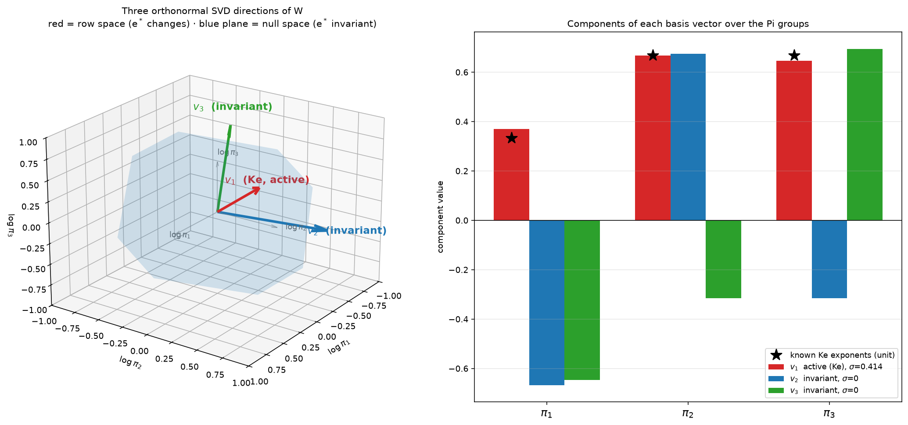

# Keyhole Welding Symmetry Discovery

Discover the hidden scaling symmetry in laser keyhole welding data using the
PyDimension Stage1 pipeline. No formula for the dimensionless groups is
supplied — the pipeline recovers the invariance entirely from the data.

---

## Physics Background

A focused laser beam drills a vapour cavity (keyhole) into a metal workpiece.
The keyhole eccentricity `e*` (also written `Ke`) depends on **seven physical
inputs** with **four fundamental dimensions** (Mass, Length, Time, Temperature):

| Variable | Symbol | SI Units | Dimensions |
|---|---|---|---|
| Absorbed laser power | `etaP` | W | kg·m²·s⁻³ |
| Scan speed | `Vs` | m/s | m·s⁻¹ |
| Beam radius | `r0` | m | m |
| Thermal diffusivity | `alpha` | m²/s | m²·s⁻¹ |
| Density | `rho` | kg/m³ | kg·m⁻³ |
| Specific heat capacity | `cp` | J/(kg·K) | m²·s⁻²·K⁻¹ |
| Superheat (liquidus − ambient) | `Tl-T0` | K | K |

By the **Buckingham Pi theorem** (7 variables − 4 dimensions = **3 independent
dimensionless groups**), eccentricity is fully determined by three Pi groups:

```
e* = f(π₁, π₂, π₃)
```

---

## Dataset — `dataset_keyhole.csv`

| Property | Value |
|---|---|
| Samples | 90 experimental points |
| Input columns | `etaP`, `Vs`, `r0`, `alpha`, `rho`, `cp`, `Tl-T0` |
| Output column | `e*` (keyhole eccentricity, dimensionless) |
| `Ke` range | 1.543 – 37.74 |

---

## Pipeline: Steps, Inputs, and Outputs

### Step 0 — Dimensional Analysis (Buckingham-Pi Reduction)

**Input:** The 7×4 dimension matrix (7 variables, 4 fundamental dimensions).

**What it does:**
Calls `pydimension.data_preprocessing.DataPreprocessor` to compute the
null-space of the dimension matrix, then simplifies the basis to **primitive
integer exponent vectors** via SymPy. An explicit `dimension_matrix.csv` is
written to `_da_repo/` and passed to the pipeline to bypass the unit-string
parser. Falls back to an inline scipy/SymPy implementation if pydimension is
unavailable.

**Actual output — 3 Pi groups discovered:**

```
π1 = Vs × r0 × alpha⁻¹          (Péclet number: advection / diffusion)
π2 = etaP × Vs⁻³ × r0⁻² × rho⁻¹  (power / kinetic energy flux)
π3 = Vs² × cp⁻¹ × (Tl-T0)⁻¹      (kinetic / thermal energy ratio)
```

Verification: the known Ke exponent vector projects onto the null-space with
**cos = +1.0000** — confirming the textbook formula lies exactly in the
discovered span.

---

### Step 1 — Normalisation

**Input:** Raw physical matrix `X` (90×7) and output `y` (90,).

**What it does:**
- Applies **min-max scaling** to raw physical `X` → `X_norm_raw` (for Step 3).
- Separately min-max scales the 3 Pi features → `X_norm_step2` (for Step 2).

**Outputs:**
- `X_norm_step2` — 3 Pi features scaled to [0, 1] (input to Step 2).
- `pi_centred` — 3 Pi **values** divided by their per-column geometric mean
  (input to Step 3; a purely multiplicative rescaling, no min-max).
- `y_norm` — min-max scaled eccentricity.

---

### Step 2 — Latent Dimension Discovery

**Goal:** Find the smallest number of coordinates `k*` that can predict `e*`.

**Input:** The **3 Pi features only** (pi-only mode, default). No `[X, X²,
log|X|]` augmentation — the encoder receives the dimensionless groups directly.

**Encoder architecture:** Multilayer MLP (default hidden dims `[64, 32]`):
```
3  →  Linear(64)  →  ReLU  →  Linear(32)  →  ReLU  →  Linear(k)
```
Paired with a nonlinear decoder (two 64-unit hidden layers). Trained end-to-end
to minimise MSE of `e*`. Sweep over `k = 1, 2, 3, 4`.

**Actual results:**

| k | R2_train | R2_test | MSE |
|---|---|---|---|
| **1** | **0.9821** | **0.9820** | **0.001108** ← optimal |
| 2 | 0.9853 | 0.9795 | 0.001263 |
| 3 | 0.9840 | 0.9797 | 0.001247 |
| 4 | 0.9840 | 0.9794 | 0.001270 |

**`k* = 1`** — a single latent coordinate explains 98.2% of the variance in
both train and test sets. Adding more latent dimensions gives negligible gain
(≤ 0.003 R² improvement) while the test R² slightly drops, indicating one
coordinate is sufficient. The near-perfect train/test R² alignment (0.9821 vs
0.9820) confirms no overfitting.

---

### Step 3 — Symmetry Type Identification

**Goal:** Determine whether the invariance is scaling, translational, or
rotational.

**Input:** The 3 Pi **values**, geometric-mean-centred (`pi_centred`).

> Pi-only Step 3: the input is the Pi group values themselves (not the
> pre-log-scaled Step 2 features, and not raw physical X). Because the
> centring is purely multiplicative (each column divided by a constant),
> the scaling encoder's internal `log` sees centred log-Pi coordinates —
> there is no `log(log(·))` degeneracy, and the discovered weight vector
> and generators live directly in dimensionless Pi space.

**What it does:** Trains three single-linear-layer encoders, each applying a
different input transform before the shared decoder from Step 2:

| Encoder | Transform | What it tests |
|---|---|---|
| Scaling | `z = W · log(Pi)` | Power-law / dimensional symmetry |
| Translational | `z = W · Pi` | Additive / affine symmetry |
| Rotational | `z = W · Pi²` | Quadratic / Euclidean symmetry |

**Actual results:**

```
scaling        : 0.001615  ← winner
translational  : 0.027839
rotational     : 0.032845
Loss gap: ~17-19×
```

**Scaling wins by ~17×** over translational — far more decisive than the
6× gap obtained when Step 3 ran on raw physical X. Working in Pi space
removes the min-max distortion of the raw variables and lets the log
encoder align directly with the multiplicative structure.

---

### Step 4 — Generator Extraction

**Goal:** Extract the explicit directions in Pi space along which `e*` is
invariant.

**Input:** Winning (scaling) encoder weight matrix `W` (shape `1 × 3`).

**Discovered law:** The known keyhole number decomposes exactly in the
discovered Pi basis as `Ke = π1^0.5 · π2 · π3`, i.e. Pi-exponents
`[0.5, 1, 1]`. The winning encoder row satisfies

```
cos( W , [0.5, 1, 1] ) = ±0.9992
```

— the encoder **rediscovered Ke from data** (sign is arbitrary).

**What it does:** For a scaling symmetry, invariance requires `W · g = 0`.
The generators are the **null-space of W** — there are `3 − 1 = 2` generators.

Each generator `g` is a 3-vector: simultaneously rescaling Pi group `k` by
`exp(ε·gₖ)` for any `ε` leaves `e*` unchanged.

---

### Step 5 — Physical Interpretation

**Actual generators (Pi space):**
<p align="center">
  
</p>
| Generator | Trade-off | Physical meaning |
|---|---|---|
| 1 | `π1` × exp(−0.67ε), `π2` × exp(+0.67ε), `π3` × exp(−0.32ε) | Lower Péclet number offset by a higher power/kinetic ratio |
| 2 | `π1` × exp(−0.64ε), `π2` × exp(−0.32ε), `π3` × exp(+0.70ε) | Higher kinetic/thermal ratio offset by lower Péclet and power ratios |

Both generators are orthogonal to the discovered `W ∝ [0.5, 1, 1]` — they
span the 2-D iso-`Ke` surface in log-Pi space. Along either direction the
known `Ke` changes by less than 3% over `|ε| ≤ 0.5` (it would be exactly 0
if `W` matched `[0.5, 1, 1]` perfectly).

### Generator check — flat lines (`plot_generator_lines.py`)

The simplest confirmation that the model embodies these generators
(`output_keyhole_symmetry/generator_lines.png` / `.pdf`): take two real
keyhole cases (a low-`e*` and a high-`e*` one), **rescale their Pi
groups along each generator**, `πᵢ → πᵢ·exp(ε·gᵢ)`, and feed every
rescaled point through the **genuine trained model end-to-end** —
`e* = decoder(encoder(π))`, using the saved scaling encoder and its
jointly trained decoder (`trained_model.pt`), no refit (the model
reproduces measured `e*` at R² ≈ 0.98). The four solid lines are
**flat** — the predicted `e*` moves by ~10⁻⁶ (numerical zero) as the Pi
groups are rescaled along a generator (all four in a single panel — the
per-generator plots are identical). For contrast, the same panel also
rescales along the **Ke direction** (dashed): `e*` then swings across
the full 0–13 range of the dataset. Because the scaling encoder computes
`z = W·log(π)` with `W·g = 0`, the flatness is exact by construction —
the Pi values go straight into the real model and the output does not
move. This is the model-side consistency check that the discovered
scaling symmetry (the rediscovered keyhole number `Ke`) is faithfully
represented. Run it after `discover_symmetry.py`:

```bash
python plot_generator_lines.py
```

---

## Output Files

All outputs go to `output_keyhole_symmetry/` (configurable via `--output-dir`).

| File | Contents |
|---|---|
| `keyhole_pi_candidates.png` | Pi-basis exponent heatmap + scatter of `e*` vs each `log₁₀(Πₖ)` with logistic fit and R² |
| `keyhole_symmetry_discovery.png` | 3-panel: Pi-collapse, symmetry-type bar chart, discovered iso-invariant orbits in log-space |
| `keyhole_discovered_law_generators.png` | 4-panel (Pi space): discovered `W` vs known Ke Pi-exponents `[0.5, 1, 1]`, `e*` collapse onto the discovered latent, heatmap of the 2 null-space generators, and orbit-invariance check (`z` exactly flat, textbook `Ke` drift < 3%) |
| `generator_lines.png` / `.pdf` | Two real cases rescaled along each generator: four flat `e*` lines (change ~10⁻⁶) vs the bending Ke-direction contrast |
| `pipeline_artifacts.npz` | Centred Pi values, `e*`, `Ke`, encoder `W`, generators, Ke exponents, and the `e*` min-max scaling (input to `plot_generator_lines.py`) |
| `trained_model.pt` | The genuine trained model: winning scaling encoder + its jointly trained decoder (used end-to-end by `plot_generator_lines.py`) |
| `_da_repo/dimension_matrix.csv` | Explicit dimension matrix fed to `DataPreprocessor` |
| `_da_repo/basis_vectors.csv` | Integer Pi-group exponent vectors |

---

## Usage

```bash
cd projects/20260912_Stage1_Prokash/Examples/keyhole_symmetry

# Default: Pi-only input to Step 2 (recommended)
python discover_symmetry.py --data dataset_keyhole.csv

# Deeper encoder:
python discover_symmetry.py --data dataset_keyhole.csv --encoder-hidden 128 64 32

# Ablation: disable pi-only — feed [X, X², log|X|, Pi] augmented input to Step 2
python discover_symmetry.py --data dataset_keyhole.csv --no-pi-only

# Increase training length for more stable results:
python discover_symmetry.py --data dataset_keyhole.csv --sym-epochs 2000
```

Default training budget: `--latent-epochs 600`, `--sym-epochs 1500`,
`--n-restarts 3`, `--encoder-hidden 64 32`.

---

## Summary of Observed Results

| Aspect | Result |
|---|---|
| Pi groups discovered | 3 (π1 = Péclet, π2 = power/kinetic, π3 = kinetic/thermal) |
| Known Ke in null-space | cos = +1.0000 ✓ |
| Known Ke in Pi coordinates | `Ke = π1^0.5 · π2 · π3` (exact) |
| Latent dimension k* | **1** — single coordinate explains 98.2% variance |
| Test R² | **0.9820** (train and test nearly identical — no overfitting) |
| Symmetry type | **Scaling** — ~17× loss gap over translational (Pi-space Step 3) |
| Discovered law | cos(W, [0.5, 1, 1]) = ±0.9992 — encoder rediscovered Ke |
| Generators | 2 directions in log-Pi space (3 Pi groups − 1 latent dimension) |
| Invariance check | Ke drifts < 3% along either generator over `|ε| ≤ 0.5` |

---

## File Organization

Scripts auto-discover the `pydimension` package by walking upward from
`discover_symmetry.py`'s location — no installation needed if inside the repo:

```
PyDimension/
├── pydimension/                    ← auto-discovered
│   └── data_preprocessing/
└── projects/20260912_Stage1_Prokash/
    ├── preprocessing/
    ├── intrinsic_coordinate/
    ├── symmetry_discovery/
    └── Examples/keyhole_symmetry/
        ├── discover_symmetry.py
        └── dataset_keyhole.csv
```

Dependencies: `torch`, `numpy`, `scipy`, `sympy`, `matplotlib`, `seaborn`.
Install with `pip install -r requirements.txt` from the repo root.
